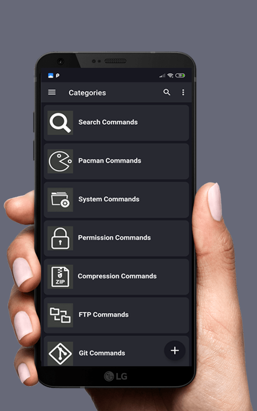
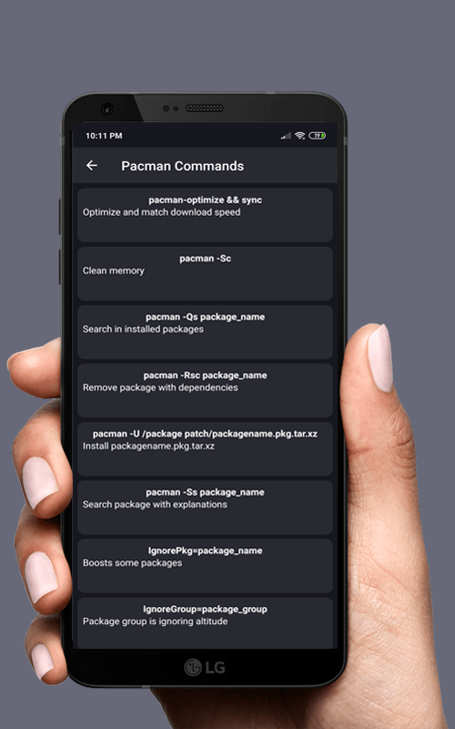
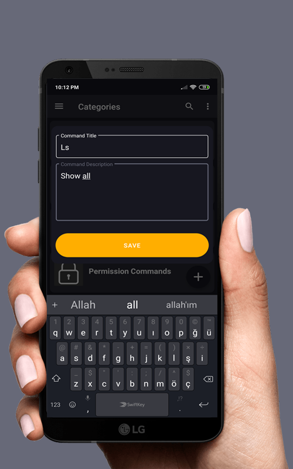
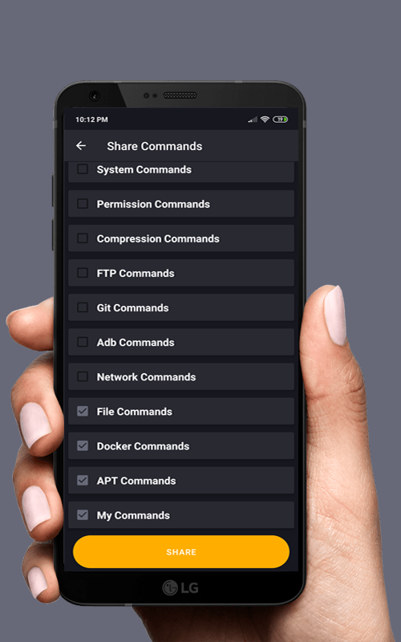

# Terminal Commands
If you use Linux or Unix os and you need a command line handbook this application maded for you. And you can save your commands to application. If you want share commands to other people on third party softwares. 
   

## Contains the following commands
- Search Commands
- Pacman Commands
- System Commands
- Permission Commands
- Compression Commands
- FTP Commands
- GIT Commands
- ADB Commands
- Network Commands
- File Commands
- Docker Commands
- APT Commands
- SSH Commands

# You can download on Google Play
- [Terminal Commands On Google Play](https://play.google.com/store/apps/details?id=hsmnzaydn.serkanozaydin.net&hl=en_US)
- [Terminal Commands Pro On Google Play](https://play.google.com/store/apps/details?id=net.serkanozaydin.hsmnzaydn)